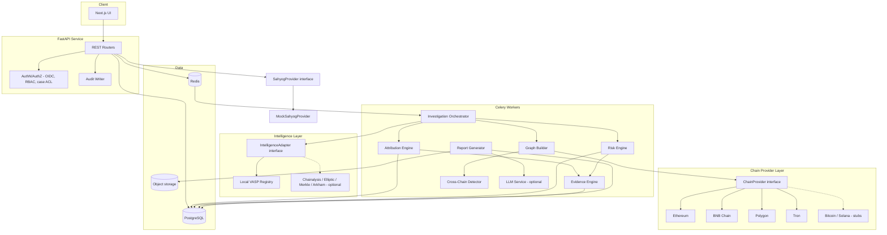
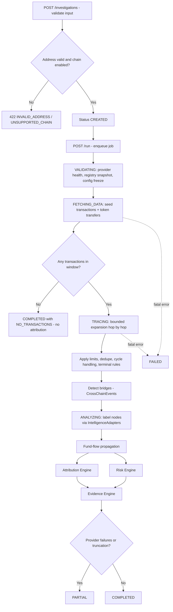

# PRD — Automated Attribution of Unknown Cryptocurrency Wallets to Nearest VASPs

**Problem Statement:** SIH26182 · Smart India Hackathon 2026
**Working name:** VASP-Trace
**Document status:** Implementation-ready v1.0 · **Document date:** 2026-10-01
**Demo "as-of" date (fixed for reproducibility):** `2026-10-01T00:00:00Z`

> **Reading conventions**
> - Priorities: **P0** = required for SIH MVP · **P1** = important · **P2** = future.
> - Epistemic labels used across data, UI and reports: `OBSERVED`, `THIRD-PARTY INTELLIGENCE`, `DERIVED`, `INFERENCE` (defined in §8.1).
> - All demo data is **SYNTHETIC**. No demo address, hash, VASP or label corresponds to a real entity.
> - Anything that depends on a production SAHYOG API, commercial intelligence vendor API, or explorer rate limits is specified behind an interface and marked **UNVERIFIED-EXTERNAL**; the team must confirm it against official documentation before production use.

---

## Table of Contents

1. Executive Summary
2. Problem Definition
3. Goals / Non-Goals
4. Users
5. User Journeys
6. Functional Requirements
7. System Architecture
8. Data Architecture
9. Blockchain Layer
10. VASP Intelligence Layer
11. Attribution Engine
12. Risk Engine
13. Evidence Engine
14. Cross-Chain Layer
15. SAHYOG Integration
16. API Specification
17. UI/UX Specification
18. Database Schema
19. Security
20. AI/LLM Usage
21. Demo Dataset
22. Demo Flow
23. Testing
24. Requirements Matrix
25. Roadmap
26. Limitations

---

## 1. Executive Summary

**Product.** VASP-Trace is an investigator-facing web platform. An investigator submits an unknown wallet address and a blockchain. The system retrieves transactions, builds a bounded transaction graph, traces fund flows across hops (and, where detectable, across bridges), identifies candidate Virtual Asset Service Providers (VASPs) that received those funds, scores each candidate with an explainable weighted model, evaluates transaction risk independently, records inspectable evidence, produces a PDF report, and prepares a data bundle for a SAHYOG lawful-disclosure/freezing workflow (mock provider in MVP).

**Core principle.** "Nearest VASP" is **not** shortest blockchain path. A candidate's rank is computed from ten factors (graph distance, known/deposit address match, cluster association, funds reaching the candidate, percentage of traced funds, transaction frequency, recency, temporal continuity, intelligence-provider confidence, cross-chain evidence). A VASP 2 hops away that received 5% of funds must not outrank a VASP 3 hops away that received 88%.

**Two independent outputs.**

| Output | Question answered | Engine | Never influenced by |
|---|---|---|---|
| VASP attribution | "Which regulated service most plausibly received/holds these funds, and how strong is that lead?" | Attribution Engine (§11) | Risk score |
| Risk assessment | "How concerning is the activity around this wallet?" | Risk Engine (§12) | Attribution confidence |

**Epistemic stance.** Attribution is an *investigative lead*, not proof of ownership or criminality. Every output carries explicit limitations. A VASP is never marked illicit because a high-risk wallet sent funds to it.

**MVP boundary.**

| In MVP (P0) | Deferred |
|---|---|
| Chains: Ethereum, BNB Chain, Polygon, Tron (this order) | Bitcoin, Solana (interfaces + stubs only, P2) |
| Public blockchain data + curated **synthetic** VASP registry | Commercial intelligence (Chainalysis, Elliptic, Merkle Science, Arkham) — adapter stubs, optional, P1/P2 |
| 3-hop default, 5-hop max (configurable to 7 as P1) | Full cross-chain path stitching across arbitrary bridges (P2) |
| Bridge-event **detection** for registered bridges, `CrossChainEvent` model, one demo bridge fully matched | Neo4j graph engine (abstraction only) |
| PostgreSQL graph storage | Production SAHYOG integration (requires official APIs/authorization) |
| PDF report, evidence ledger, audit log, RBAC | Real-time monitoring / alerts |
| `MockSahyogProvider` | Mobile app |

**Primary deliverable for SIH.** A deterministic, reproducible demo with five synthetic cases (§21–22) that runs end-to-end in ≤ 5 minutes, plus a live-mode path on public chain data for Ethereum/BNB/Polygon/Tron.

---

## 2. Problem Definition

### 2.1 Problem

Law-enforcement investigators who encounter an unknown cryptocurrency wallet (e.g., a scam-proceeds wallet in a complaint) must identify which VASP(s) — typically exchanges or custodial services — received the funds, because VASPs hold KYC records and can be served lawful requests or freeze orders. Today this is manual: transactions are read on block explorers, addresses are checked against scattered labels, and judgment about "which exchange" is not documented or reproducible.

### 2.2 Why shortest path is the wrong model

| Failure mode of shortest-path | Example | Required handling |
|---|---|---|
| Tiny side-transfer to an exchange wins | Wallet sends 1% of funds to Exchange X (hop 1) and 90% via 3 hops to Exchange Y | Weight by funds and % of traced flow |
| Stale interaction wins | Hop-1 interaction 14 months ago | Recency + temporal continuity |
| Unverified label wins | Community label on a hop-1 address | Intelligence confidence + source verification |
| Hot wallet vs. deposit address confused | Funds to a hot wallet may be internal VASP movement | `address_type` is evidence, not decoration |
| Cross-chain flow ignored | Funds bridge to another chain, then deposit | Cross-chain evidence factor |
| Mixer treated as VASP | Path ends at a mixer | Mixer = service node, terminal; excluded from VASP candidates |

### 2.3 Inputs and outputs

| Input | Type | Validation |
|---|---|---|
| `wallet_address` | string | Chain-specific format + checksum (EIP-55 if mixed case; Tron Base58Check) |
| `blockchain` | enum `ethereum, bnb_chain, polygon, tron` (MVP); `bitcoin, solana` (architecture only) | Must be enabled in config |
| `analysis_window` | `[start, end]` UTC | Default: last 90 days to `as_of`; max 730 days |
| `max_depth` | int | Default 3; MVP max 5; P1 max 7 |
| `case_id` | UUID | Must exist and user must be authorized |
| `thresholds` | object | min USD value, node/edge/tx limits (§8.5) |

| Output | Detail |
|---|---|
| Attribution results | Ranked candidate list with score, tier, contributing factors, evidence, limitations (§11) |
| Risk result | Score, tier, factors, evidence (§12) |
| Transaction graph | Nodes, edges, paths, highlights (§8.4, §17) |
| Evidence ledger | Immutable, labeled evidence items (§13) |
| Report | PDF (§17 screen 13) |
| SAHYOG package | Structured bundle via `SahyogProvider` (§15) |

### 2.4 Glossary

| Term | Definition |
|---|---|
| Seed wallet | The unknown wallet submitted by the investigator |
| VASP | Virtual Asset Service Provider (exchange, custodian, payment processor, etc.) |
| Candidate | A registry- or intelligence-labeled address/cluster reached from the seed, belonging to a VASP |
| Deposit address | Address a VASP assigns to a customer, normally swept to a hot wallet |
| Hot / cold wallet | VASP operational / storage wallets |
| Traced funds | USD (or native) value leaving the seed within the window that the engine followed |
| Funds reached | Portion of traced funds attributed (pro-rata) to arrive at a candidate (§11.4) |
| Terminal node | Node where expansion stops (VASP, mixer, bridge, high-degree service, limit reached) |

---

## 3. Goals / Non-Goals

### 3.1 Goals

| ID | Goal | Measurable target (SIH MVP) |
|---|---|---|
| G1 | Automate candidate-VASP identification from an unknown wallet | All 5 demo cases return the expected top candidate/tier (§21) |
| G2 | Make every attribution explainable | 100% of results list per-factor contributions that sum (± 0.001) to the score |
| G3 | Make every attribution evidence-backed | 0 attributions without ≥ 1 evidence record; 0 with provider failure on the supporting path |
| G4 | Separate attribution from risk | No code path from risk fields to attribution score (verified by test AT-12) |
| G5 | Reproducibility | Same input + same data snapshot → byte-identical attribution JSON (excluding timestamps/IDs) |
| G6 | Auditability | 100% of state-changing and data-viewing actions create `audit_logs` rows |
| G7 | Extensibility | Add a chain by implementing one `ChainProvider`; add an intel source by implementing one `IntelligenceAdapter`; no analysis-engine change |
| G8 | Performance | Depth-3 investigation on demo dataset ≤ 30 s p95; live public-chain depth-3 completes or returns `PARTIAL` within configured timeout (default 5 min) |

### 3.2 Non-Goals

- Proving ownership, identity, intent or criminal liability.
- Deanonymizing mixer/privacy-protocol users.
- Real-time transaction monitoring/alerting.
- Replacing commercial blockchain-intelligence products.
- Integrating with undocumented production SAHYOG APIs.
- Automatically submitting freeze requests (human approval is mandatory).
- Using an LLM to determine attribution, risk, or criminality.
- Legal advice or admissibility guarantees.

---

## 4. Users

### 4.1 Personas

| Role | Code | Primary job | Key needs |
|---|---|---|---|
| Investigator | `INV` | Run investigations on assigned cases, review attribution, prepare reports and SAHYOG drafts | Fast tracing, clear candidate comparison, evidence it can defend |
| Financial Intelligence Analyst | `FIA` | Deep-dive analysis, curate VASP registry entries, validate labels | Registry editing, conflict resolution, graph filters, provenance |
| Supervisor | `SUP` | Review/approve reports and SAHYOG submissions, oversee team cases | Approval workflow, team dashboards, override visibility |
| Auditor | `AUD` | Verify process integrity and access history | Immutable audit logs, export, no case content by default |
| Administrator | `ADM` | Manage users, roles, providers, keys, retention | Config UI, provider health, no silent case access |
| Read-only Officer | `RO` | View shared findings/reports | Read reports and summaries only |

### 4.2 RBAC permission matrix

Scope key: `O` = own/assigned cases · `U` = cases of own organization unit · `Org` = whole organization · `M` = metadata only (no wallets/evidence content) · `—` = denied.

| Permission | INV | FIA | SUP | AUD | ADM | RO |
|---|---|---|---|---|---|---|
| `case.create` | ✔ | ✔ | ✔ | — | — | — |
| `case.read` | O | O | U | M | M | O (shared) |
| `case.update` (notes, status) | O | O | U | — | — | — |
| `case.assign` | — | — | U | — | — | — |
| `investigation.run` / `cancel` | O | O | U | — | — | — |
| `graph.view` | O | O | U | — | — | O (shared) |
| `graph.expand` | O | O | U | — | — | — |
| `graph.export` | O | O | U | — | — | — |
| `attribution.view` | O | O | U | — | — | O (shared) |
| `attribution.annotate` (accept/reject candidate as INFERENCE) | O | O | U | — | — | — |
| `risk.view` | O | O | U | — | — | O (shared) |
| `evidence.view` | O | O | U | — | — | O (shared) |
| `evidence.add_note` / `evidence.attach_manual` | O | O | U | — | — | — |
| `vasp.view` | ✔ | ✔ | ✔ | ✔ | ✔ | ✔ |
| `vasp.manage` (registry CRUD, import) | — | ✔ | — | — | ✔ | — |
| `report.generate` | O | O | U | — | — | — |
| `report.approve` | — | — | U | — | — | — |
| `report.download` | O | O | U | — | — | O (approved & shared) |
| `sahyog.draft` | O | O | U | — | — | — |
| `sahyog.submit` (requires approved report) | — | — | U | — | — | — |
| `sahyog.view` | O | O | U | — | — | O (shared) |
| `audit.view` | own actions | own actions | U | Org | Org | — |
| `audit.export` | — | — | — | ✔ | — | — |
| `user.manage` / `role.manage` | — | — | — | — | ✔ | — |
| `provider.configure` (keys, enable chain/adapter) | — | — | — | — | ✔ | — |
| `settings.thresholds` (org defaults) | — | — | U | — | ✔ | — |
| `retention.manage` | — | — | — | — | ✔ | — |
| `llm.use` (summaries/report drafts) | ✔ | ✔ | ✔ | — | — | — |

**Rules**
1. **Case-level authorization** (P0): access requires role permission **and** one of: assigned to the case, member of case ACL (`case_members`), or supervisor of the owning unit. Role alone is insufficient.
2. **Separation of duties** (P0): the user who generated a report cannot approve it; the user who drafted a SAHYOG request cannot submit it (`SUP` must be a different user).
3. **Admin ≠ content access** (P0): `ADM` sees case metadata only; granting itself case membership is audited and requires a second `SUP`/`ADM` approval (P1).
4. **Auditor** reads audit logs and case metadata; case content access requires explicit time-boxed grant (P1).
5. Every permission check outcome (allow/deny) is written to `audit_logs`.

---

## 5. User Journeys

### J1 — Investigator: unknown wallet to SAHYOG draft (primary)

| Step | Actor action | System response | Data/Output |
|---|---|---|---|
| 1 | Logs in (OIDC; MFA if enforced) | Issues session/JWT, loads dashboard of assigned cases | `audit: LOGIN` |
| 2 | Opens/creates a case (reference number, organization) | Creates `cases` row, status `CREATED` | `case_id` |
| 3 | New Investigation: pastes wallet, selects chain, window, depth | Validates format instantly; shows warnings (e.g., depth > 3 may be partial) | Inline validation |
| 4 | Clicks Run | `POST /investigations/{id}/run` → job queued → states `VALIDATING → FETCHING_DATA → TRACING → ANALYZING` | Live progress via polling/SSE |
| 5 | Reviews Overview | Shows top candidate, tier, risk tier, coverage %, warnings (separate cards) | Overview |
| 6 | Opens Graph | Sees seed, paths, VASP nodes highlighted, risk overlay toggle | Graph |
| 7 | Opens Candidate Comparison → "Explain Attribution" | Per-factor contribution table, caps applied, evidence list, limitations | Explanation |
| 8 | Adds analyst note / accepts or rejects a candidate | Stored as `INFERENCE`, audited | Evidence item |
| 9 | Generates Report | PDF generated, hash recorded, status `PENDING_APPROVAL` | `report_id` |
| 10 | Creates SAHYOG draft | Mock request assembled from case data; validation shown | `sahyog_request_id` (DRAFT) |
| 11 | Supervisor approves report and submits mock request | Mock status progresses `SUBMITTED → ACKNOWLEDGED` | Tracking |

### J2 — Analyst: resolve conflicting VASP labels

1. Opens candidate flagged `CONFLICTING_LABELS` (two sources label one address as different VASPs).
2. Views both registry records with source, evidence type, last_verified.
3. Marks one as `status=SUPERSEDED` with justification or raises `DISPUTED`.
4. Re-runs attribution on the investigation (new `attribution_results` version; old retained).
5. Audit shows who changed the registry and why.

### J3 — Supervisor: review and approve

1. Opens "Pending approvals" on dashboard.
2. Reviews report preview, confidence tiers, limitations, analyst notes.
3. Approves/rejects with comment; separation-of-duties enforced.
4. Submits SAHYOG mock request; tracks status.

### J4 — Auditor: verify access history

1. Filters audit logs by case/user/action/date.
2. Verifies hash chain integrity (button runs `verify_audit_chain`).
3. Exports CSV/JSON (export itself audited).

### J5 — Investigator: partial result due to provider outage

1. Run starts; Tron provider times out after retries.
2. Investigation ends `PARTIAL`; UI shows which sub-trees are incomplete.
3. Attribution on incomplete paths is capped (CAP-06) or withheld; investigator can **Resume** failed segments later.

### J6 — Administrator: configure providers

1. Adds explorer API key (stored in secrets manager reference, never displayed again).
2. Runs provider health check; sees latency, error rate, quota remaining (if exposed).
3. Enables/disables chains and intelligence adapters; changes audited.

---

## 6. Functional Requirements

Format: **ID · Description (data → processing → output) · Priority · Acceptance criteria.** The traceability matrix in §24 maps these to user stories, tests and roadmap phases.

### 6.1 Authentication, users, cases (AUTH/CASE)

| ID | Description | Pri | Acceptance criteria |
|---|---|---|---|
| FR-AUTH-01 | OIDC-ready login (local dev IdP + JWT access tokens, refresh rotation) | P0 | Valid login returns token with `sub`, `roles`, `org_id`; expired token → 401; revoked refresh token rejected |
| FR-AUTH-02 | RBAC enforcement on every endpoint using permissions in §4.2 | P0 | Test matrix: each role × endpoint returns documented allow/deny; denies logged |
| FR-AUTH-03 | MFA-ready: `mfa_required` flag per role; TOTP enrollment endpoint stubbed | P1 | When flag true, token without `amr: mfa` is rejected for `sahyog.submit`, `report.approve` |
| FR-CASE-01 | Create case: `reference_number` (unique per org), title, organization, description | P0 | Duplicate reference in same org → 409; creator becomes case member with `owner` |
| FR-CASE-02 | List cases with filters (status, date, investigator) + pagination | P0 | Returns only cases user is authorized for; page size ≤ 100 |
| FR-CASE-03 | Case detail: wallets, investigations, notes, evidence count, reports, audit summary | P0 | All sections load; unauthorized → 404 (not 403) to avoid existence leak |
| FR-CASE-04 | Case notes (append-only with edit history) | P0 | Edit creates new version; prior version retrievable |
| FR-CASE-05 | Case ACL management (supervisor) | P1 | Adding/removing member audited |

### 6.2 Investigation orchestration (INV)

| ID | Description | Pri | Acceptance criteria |
|---|---|---|---|
| FR-INV-01 | Create investigation: wallet, chain, window, depth, thresholds → status `CREATED` | P0 | Invalid address → 422 with `INVALID_ADDRESS`; unsupported chain → 422 `UNSUPPORTED_CHAIN`; no job started |
| FR-INV-02 | Run investigation asynchronously via worker; idempotent per `(investigation_id, run_no)` | P0 | Second `run` while running → 409; returns `job_id` immediately (≤ 500 ms) |
| FR-INV-03 | State machine `CREATED→VALIDATING→FETCHING_DATA→TRACING→ANALYZING→COMPLETED/PARTIAL/FAILED` with timestamps per transition | P0 | Illegal transitions rejected; each transition audited |
| FR-INV-04 | Progress reporting: stage, nodes/edges counts, provider calls, warnings | P0 | `GET /status` returns monotonic progress; updates ≤ 2 s latency |
| FR-INV-05 | Cancel running investigation | P1 | Worker stops within 10 s; state `FAILED` with `reason=CANCELLED`; partial data retained and flagged |
| FR-INV-06 | Resume/re-run failed segments | P1 | Only failed frontier nodes re-fetched; new run references prior run |
| FR-INV-07 | Immutable data snapshot per run (provider responses hashed, `data_snapshot_id`) | P0 | Re-analysis on same snapshot reproduces identical attribution (G5) |

### 6.3 Blockchain data (DATA)

| ID | Description | Pri | Acceptance criteria |
|---|---|---|---|
| FR-DATA-01 | `ChainProvider` interface (§9.2) with implementations for Ethereum, BNB Chain, Polygon, Tron | P0 | Contract tests pass for each provider using recorded fixtures |
| FR-DATA-02 | Address validation per chain | P0 | Valid/invalid vectors in §23 pass; checksum mismatch rejected |
| FR-DATA-03 | Fetch native + token transfers (+ internal transactions where provider supports) for an address and window, paginated | P0 | Pagination exhausts; truncation flagged if `max_tx_per_node` hit |
| FR-DATA-04 | Rate limiting (token bucket per provider/key), retry with backoff+jitter, per-call timeout, circuit breaker | P0 | Under simulated 429, calls retried ≤ N; breaker opens after threshold; no request storm |
| FR-DATA-05 | Cache provider responses in Redis (TTL by data type) and persist canonical records | P0 | Second identical call is cache hit; finalized-block data TTL ≥ 24 h |
| FR-DATA-06 | Provider failure never produces fabricated data | P0 | On failure, affected node marked `FETCH_FAILED`; no edges invented |
| FR-DATA-07 | Duplicate transaction detection | P0 | Unique key `(chain, tx_hash, log_index/trace_id, from, to, asset)` enforced; duplicates counted in diagnostics |
| FR-DATA-08 | Bitcoin/Solana provider stubs raising `UnsupportedChain` | P2 | Registry lists them as `architecture_only` |

### 6.4 Graph (GRAPH)

| ID | Description | Pri | Acceptance criteria |
|---|---|---|---|
| FR-GRAPH-01 | Build graph with node types (wallet, contract, vasp, cluster, bridge, service) and edge types (native, token, contract_call, bridge, swap) | P0 | Schema constraints enforce enums |
| FR-GRAPH-02 | Configurable depth (default 3; MVP max 5; P1 max 7) | P0 | Depth > max → 422; hop counts correct on branching test graph |
| FR-GRAPH-03 | Explosion controls: tx limit/node, min USD, time window, node cap/hop, global node/edge caps, dedup, cycle handling | P0 | Stress test with 100k-edge fixture stops at caps, sets `PARTIAL` + `truncation_report` |
| FR-GRAPH-04 | Terminal-node rules (VASP, mixer, bridge → cross-chain handler, high-degree service) | P0 | Expansion never continues past terminal nodes |
| FR-GRAPH-05 | Chronological flow consistency (outflow only counted after inflow arrival) | P0 | Test: edge earlier than any inflow carries zero traced funds |
| FR-GRAPH-06 | Graph engine abstraction `GraphEngine` (PostgreSQL impl; Neo4j placeholder) | P0 | Analysis modules import only the interface |
| FR-GRAPH-07 | Graph retrieval API with filters (chain, date, asset, min value, depth) | P0 | Filter results match DB ground truth in tests |
| FR-GRAPH-08 | Graph export (JSON, GraphML, PNG/SVG from UI) | P1 | Export contains provenance labels; export audited |

### 6.5 VASP registry and intelligence (REG)

| ID | Description | Pri | Acceptance criteria |
|---|---|---|---|
| FR-REG-01 | Registry schema per §10.2 with constraints | P0 | Invalid enum/duplicate `(chain,address,vasp_id)` active record rejected |
| FR-REG-02 | Import registry from CSV/JSON with validation report | P0 | Row-level errors reported; valid rows loaded transactionally |
| FR-REG-03 | Registry lookup by `(chain,address)` returning all active records incl. conflicts | P0 | Conflicting labels returned as list, never silently merged |
| FR-REG-04 | Cluster membership resolution | P0 | Address in cluster inherits cluster VASP with `cluster_match` evidence |
| FR-REG-05 | `IntelligenceAdapter` interface; adapters for Local Registry (implemented), Chainalysis/Elliptic/Merkle/Arkham (stubs, optional) | P0 (interface+local), P2 (commercial) | System fully functional with all commercial adapters disabled |
| FR-REG-06 | Staleness detection (`last_verified` age) | P0 | >180 d reduces known-match strength; >365 d triggers cap CAP-07 |
| FR-REG-07 | Registry CRUD UI for FIA/ADM with change history | P1 | Every change versioned and audited |

### 6.6 Attribution (ATT)

| ID | Description | Pri | Acceptance criteria |
|---|---|---|---|
| FR-ATT-01 | Candidate discovery: any traced node/cluster matching registry or adapter label of type VASP-class | P0 | Mixers/bridges never listed as VASP candidates |
| FR-ATT-02 | Compute 10 features with normalization per §11.3 | P0 | Unit tests per feature with boundary values |
| FR-ATT-03 | Weighted score with weight renormalization over applicable features | P0 | Sum of contributions = score ± 0.001; weights loaded from config version |
| FR-ATT-04 | Tier assignment with cap rules CAP-01…CAP-08 | P0 | Each cap has a test; applied caps listed in output |
| FR-ATT-05 | Evidence gate: no attribution without ≥ 1 qualifying evidence (registry/intel match) | P0 | Seed with only unlabeled neighbors → `INSUFFICIENT EVIDENCE`, empty candidate list with reason |
| FR-ATT-06 | Competing-candidate detection (top-2 margin < 0.15) | P0 | Flag `COMPETING_CANDIDATES` shown on UI/report |
| FR-ATT-07 | "Explain Attribution" payload (factors, raw values, weights, contributions, caps, evidence refs, limitations) | P0 | Payload renders without extra computation on client |
| FR-ATT-08 | Versioned results (`attribution_results.version`, `weights_version`, `registry_snapshot`) | P0 | Re-run creates new version; old retrievable |
| FR-ATT-09 | Investigator disposition (accept/reject/needs-review) stored separately as `INFERENCE`, never altering score | P0 | Score unchanged after disposition |

### 6.7 Risk (RISK)

| ID | Description | Pri | Acceptance criteria |
|---|---|---|---|
| FR-RISK-01 | Risk signals per §12.2 computed from graph + intelligence | P0 (mixer, rapid movement, peel chain, high-value, high-risk counterparty from local list), P1 (sanctions/ransomware/darknet via adapters) | Each signal has detection test with fixtures |
| FR-RISK-02 | Score and tier per §12.3 | P0 | Case 4 yields risk 72 / HIGH |
| FR-RISK-03 | Independence from attribution | P0 | Test AT-12: toggling risk data does not change attribution output |
| FR-RISK-04 | Rule: never flag VASP as illicit from counterparty risk | P0 | VASP nodes carry no risk score; UI wording test |

### 6.8 Evidence (EVD)

| ID | Description | Pri | Acceptance criteria |
|---|---|---|---|
| FR-EVD-01 | Evidence schema §13.1; every attribution result links ≥ 1 evidence | P0 | FK + application invariant tested |
| FR-EVD-02 | Evidence immutability with hash chain; analyst notes append-only | P0 | UPDATE/DELETE blocked by DB trigger; hash verification passes |
| FR-EVD-03 | Evidence ledger UI with filters and label (OBSERVED/THIRD-PARTY/DERIVED/INFERENCE) | P0 | Filter results correct |
| FR-EVD-04 | Evidence-on-edge display in graph | P0 | Clicking an edge lists linked evidence |

### 6.9 Cross-chain (XCH)

| ID | Description | Pri | Acceptance criteria |
|---|---|---|---|
| FR-XCH-01 | Bridge registry (contract addresses, event ABI, supported chain pairs) | P0 | Demo bridge present |
| FR-XCH-02 | Bridge-event detection on traced edges | P0 | Case 5 yields one `CrossChainEvent` |
| FR-XCH-03 | Source↔destination matching (amount±fee, time window, bridge-provided id) with confidence | P0 (demo bridge), P2 (generic) | Ambiguous matches produce `confidence < 0.80` and cap |
| FR-XCH-04 | Continue trace on destination chain when match confidence ≥ 0.50 | P1 | Destination edges tagged `via_cross_chain_event_id` |
| FR-XCH-05 | Extension architecture documented and unit-tested via stub bridge adapter | P0 | Adding stub adapter requires no engine change |

### 6.10 Reports and SAHYOG (RPT/SAH)

| ID | Description | Pri | Acceptance criteria |
|---|---|---|---|
| FR-RPT-01 | Generate PDF with all sections in §17 screen 13 | P0 | PDF contains every listed section; checksum stored |
| FR-RPT-02 | Label every datum OBSERVED/THIRD-PARTY INTELLIGENCE/DERIVED/INFERENCE | P0 | Automated check: no unlabeled facts table rows |
| FR-RPT-03 | Mandatory limitations and legal/investigative disclaimer on every report | P0 | Cannot be disabled |
| FR-RPT-04 | Report approval workflow (separation of duties) | P1 | Same-user approval rejected |
| FR-SAH-01 | `SahyogProvider` interface and `MockSahyogProvider` | P0 | All 7 operations implemented in mock |
| FR-SAH-02 | SAHYOG request builder from case data with completeness validation | P0 | Missing mandatory field → request stays `DRAFT` with error list |
| FR-SAH-03 | No invented production endpoints; mock clearly labeled | P0 | UI banner "MOCK — not transmitted to any authority" on every SAHYOG screen |
| FR-SAH-04 | Status tracking in mock (time-based transitions) | P0 | Status history persisted |

### 6.11 AI, security, operations (AI/SEC/OPS)

| ID | Description | Pri | Acceptance criteria |
|---|---|---|---|
| FR-AI-01 | LLM summaries/explanations/report drafts grounded in structured JSON | P1 | Output validator rejects any address/hash/VASP not in input (test LLM-03) |
| FR-AI-02 | Deterministic template fallback when LLM disabled | P0 | Report generates fully without LLM |
| FR-SEC-01 | Audit log for all actions with hash chain | P0 | Chain verification passes; tamper test fails verification |
| FR-SEC-02 | Input validation, SSRF protection, rate limiting | P0 | SSRF test vectors blocked (§19.6) |
| FR-SEC-03 | Secrets via env/secret manager; never logged/returned | P0 | Log scan test finds no key material |
| FR-OPS-01 | Docker Compose one-command bring-up with seeded demo data | P0 | `docker compose up` + `make seed-demo` produces runnable app |
| FR-OPS-02 | Health endpoints and provider health dashboard | P1 | `/health/live`, `/health/ready` |
| FR-OPS-03 | Retention/deletion jobs | P1 | Expired cases anonymized/deleted per policy with audit |


---

## 7. System Architecture

### 7.1 Stack

| Layer | Technology | Notes |
|---|---|---|
| Frontend | Next.js (App Router) + TypeScript + Tailwind CSS | Graph via Cytoscape.js (or Sigma.js); charts via Recharts |
| API | FastAPI (Python 3.11+), Pydantic v2, SQLAlchemy 2 + Alembic | OpenAPI auto-generated |
| Async workers | Celery (or RQ) + Redis broker | One queue per stage: `fetch`, `trace`, `analyze`, `report` |
| Database | PostgreSQL 15+ | Graph stored relationally; `GraphEngine` abstraction |
| Cache / rate-limit / locks | Redis | Provider response cache, token buckets, idempotency keys |
| Object storage | Local volume (MVP) / S3-compatible (P1) | PDF reports, snapshots |
| Packaging | Docker + Docker Compose | Services: `web`, `api`, `worker`, `beat`, `postgres`, `redis`, `idp` (dev Keycloak, optional) |

### 7.2 System architecture diagram



### 7.3 Investigation flow



### 7.4 State machine

| State | Entered when | Exit conditions | Persisted |
|---|---|---|---|
| `CREATED` | Investigation row created | `run` called | Input params |
| `VALIDATING` | Worker picks job | Providers healthy for seed chain, registry snapshot taken | `config_snapshot`, `registry_snapshot_id` |
| `FETCHING_DATA` | Validation OK | Seed txs fetched (or none) | Raw responses (hashed), canonical txs |
| `TRACING` | Seed has txs | Frontier empty or limits reached | Nodes, edges, truncation report |
| `ANALYZING` | Tracing done | Attribution, risk, evidence written | Results, features, evidence |
| `COMPLETED` | All stages succeeded, no failures affecting results | — | Final |
| `PARTIAL` | Any provider failure / truncation affecting supporting data | Re-run segments (P1) | `partial_reasons[]` |
| `FAILED` | Unrecoverable error (invalid input post-validation, all providers down, cancellation, worker crash after retries) | New run | `failure_reason` |

`COMPLETED` with `no_transactions=true` and `PARTIAL` results are both valid terminal states; neither fabricates output.

### 7.5 Graph-engine abstraction

```python
class GraphEngine(Protocol):
    def upsert_nodes(self, investigation_id: UUID, nodes: Iterable[GraphNode]) -> None: ...
    def upsert_edges(self, investigation_id: UUID, edges: Iterable[GraphEdge]) -> None: ...
    def neighbors(self, investigation_id: UUID, node_id: str, direction: Literal["out","in","both"],
                  filters: EdgeFilter) -> list[GraphEdge]: ...
    def paths(self, investigation_id: UUID, source: str, targets: set[str],
              max_depth: int, filters: EdgeFilter) -> Iterator[GraphPath]: ...
    def subgraph(self, investigation_id: UUID, filters: EdgeFilter, limit: int) -> GraphView: ...
    def stats(self, investigation_id: UUID) -> GraphStats: ...
```
`PostgresGraphEngine` (MVP) uses `graph_nodes`/`graph_edges` with recursive CTEs bounded by `max_depth`. `Neo4jGraphEngine` is a documented placeholder (P2). Attribution, risk and API modules depend only on `GraphEngine`.

### 7.6 Repository layout

```text
vasp-trace/
  apps/web/                      # Next.js + TS + Tailwind
  services/api/
    app/main.py
    app/routers/                 # cases, investigations, wallets, vasps, reports, sahyog, audit
    app/core/                    # config, security, rbac, audit, errors
    app/domain/                  # pydantic models, enums
    app/providers/chains/        # base.py, ethereum.py, bnb.py, polygon.py, tron.py, bitcoin_stub.py, solana_stub.py
    app/providers/intel/         # base.py, local_registry.py, chainalysis.py, elliptic.py, merkle.py, arkham.py
    app/graph/                   # engine.py, postgres_engine.py, expansion.py, flow.py
    app/attribution/             # features.py, scoring.py, caps.py, explain.py
    app/risk/                    # signals.py, scoring.py
    app/evidence/
    app/crosschain/              # bridges.py, detector.py, matcher.py
    app/reports/                 # templates, pdf.py
    app/sahyog/                  # base.py, mock.py
    app/llm/                     # prompts, grounding, validator
    app/workers/                 # celery tasks
    alembic/
    tests/
  data/demo/                     # synthetic registry, chain fixtures, expected outputs
  docker-compose.yml
  Makefile
```

### 7.7 Deployment (MVP)

`docker-compose.yml` services: `web:3000`, `api:8000`, `worker` (concurrency 4), `beat`, `postgres:5432`, `redis:6379`, optional `keycloak:8080`. Config via `.env` (never committed). `make seed-demo` loads schema, roles, users per role, synthetic registry, chain fixtures, five demo cases.

**Modes**

| Mode | Chain data source | Use |
|---|---|---|
| `DEMO` (default for SIH) | `FixtureChainProvider` reading `data/demo/chain/*.json` | Deterministic demo; works offline |
| `LIVE` | Real explorer/RPC providers | Real addresses on public chains |

`FixtureChainProvider` implements the same `ChainProvider` interface; the engine cannot distinguish modes. Synthetic transaction IDs (`SYN-TX-…`) are accepted only when `DEMO_MODE=true`; the UI shows a persistent **SYNTHETIC DATA** ribbon.

### 7.8 Failure handling matrix

Principle: **fail visibly, degrade explicitly, never fabricate.** Every row writes a `warnings[]` item on the investigation, an audit event where state changes, and a limitation line in the report.

| # | Condition | Detection | System behavior | Investigation state | User-visible message |
|---|---|---|---|---|---|
| 1 | Invalid address | Format/checksum validation | Reject at create; no job | — (422) | "Address is not valid for <chain>: <reason>" |
| 2 | Unsupported chain | Chain not enabled | Reject; list enabled chains | — (422) | "Chain not supported in this deployment" |
| 3 | No transactions | Seed fetch returns empty within window | Stop; no graph beyond seed | `COMPLETED` (`no_transactions`) | "No transactions in window. Try widening the date range." No attribution, no risk score |
| 4 | No VASP match | Candidate discovery empty | Report graph/risk; attribution list empty | `COMPLETED` | "No registry/intelligence match among traced counterparties" (**INSUFFICIENT EVIDENCE**) |
| 5 | Insufficient evidence | All candidates score < 0.40 or gate fails | Show candidates as `INSUFFICIENT EVIDENCE`, flagged "do not use for disclosure request" | `COMPLETED` | Tier shown with reason |
| 6 | API timeout | Per-call timeout | Retry (backoff+jitter, max 3); then mark node `FETCH_FAILED`, continue other branches | `PARTIAL` | "Data for N addresses could not be retrieved" + list |
| 7 | API rate limit (429) | HTTP 429 / provider code | Honor `Retry-After`; token bucket slows; queue | continues; `PARTIAL` if exhausted | "Provider rate-limited; analysis may be incomplete" |
| 8 | Provider outage | Circuit breaker open | Try fallback provider for chain if configured; else mark segments failed | `PARTIAL` or `FAILED` (if seed fetch impossible) | Provider named; resume option |
| 9 | Malformed API response | Pydantic schema validation fails | Discard record, log hash of payload, increment `malformed_count`; if > 5% of a page, treat call as failed | `PARTIAL` | "Provider returned invalid data; records discarded" |
| 10 | Duplicate transactions | Unique-key conflict | Keep first, count duplicates; no double-counting in flow | unaffected | Diagnostics only |
| 11 | Graph explosion | Caps exceeded | Keep top-N by USD value; record dropped counts per hop | `PARTIAL` | "Graph truncated at <limit>; excluded value ≈ $X (Y%)" |
| 12 | Missing API key | Config check in VALIDATING | Use keyless/public tier if provider permits with stricter limits; else disable provider | `FAILED` if seed chain has no usable provider; else continue | "No API key configured for <provider>" (no key content ever shown) |
| 13 | Conflicting VASP labels | >1 active registry/intel label with different `VASP_ID` for same address | Do not merge; produce each as separate candidate evidence; apply CAP-04 | `COMPLETED` w/ flag | "Conflicting labels: A (source1) vs B (source2)" |
| 14 | Incomplete blockchain data | Provider flags truncation / block lag / pagination limit | Mark node `INCOMPLETE`; cap supporting attributions (CAP-06) | `PARTIAL` | Coverage % displayed |
| 15 | Ambiguous cross-chain event | >1 plausible destination match or confidence < 0.80 | Store all candidates in `CrossChainEvent.alternatives`; continue only if ≥ 0.50; apply CAP-05 | `COMPLETED` / `PARTIAL` | "Cross-chain link ambiguous (N alternatives)" |
| 16 | Price data unavailable | Price provider fails | `USD_value=null`; thresholds fall back to native amounts; fund % computed per-asset; flagged | `PARTIAL` if it affects %s | "USD valuation unavailable for <asset>" |
| 17 | Worker crash | Celery task lost | Retry from last persisted stage (idempotent stages) | resumes or `FAILED` after N | "Investigation failed after retries" |

---

## 8. Data Architecture

### 8.1 Epistemic labels (data classification)

Every stored datum that can appear in a result carries a `provenance_class`.

| Label | Meaning | Examples | Produced by | Editable? |
|---|---|---|---|---|
| `OBSERVED` | Read directly from a blockchain via a data provider | tx hash, timestamp, amount, from/to, token contract, block | `ChainProvider` | No |
| `THIRD-PARTY INTELLIGENCE` | Labels/scores from a registry or vendor | "address X belongs to VASP Y", sanctions flag, vendor risk score | `IntelligenceAdapter` | Only via registry versioning |
| `DERIVED` | Computed by this platform from the above | hop distance, fund %, features, risk score, clusters by heuristic | Engines | No (recomputed) |
| `INFERENCE` | Human judgment recorded by an investigator | notes, "accept candidate", linking two wallets manually | Users | Append-only |

Rules: (1) A `DERIVED` value must reference its inputs (`derived_from[]`). (2) `INFERENCE` never feeds scores. (3) LLM text is not data; it is a clearly marked narrative (§20). (4) Reports and UI render the label next to every fact.

### 8.2 Provenance record (common to evidence, nodes, edges)

```json
{
  "provenance_class": "OBSERVED",
  "source": "provider:ethereum-explorer-v1",
  "source_ref": "snapshot:3f9c…/page:2",
  "retrieved_at": "2026-10-01T09:12:44Z",
  "raw_hash": "sha256:…",
  "derived_from": []
}
```

### 8.3 Canonical models

```python
class Transfer(BaseModel):            # one row per native transfer or token Transfer log
    chain: Chain
    transaction_hash: str
    log_index: int | None             # token logs
    trace_id: str | None              # internal tx
    block_number: int
    timestamp: datetime               # UTC
    source: str                       # normalized address (lowercase hex / Tron base58)
    destination: str
    asset: str                        # "ETH", "USDT", ...
    token_contract: str | None
    amount: Decimal                   # human units
    amount_raw: str                   # integer string, unmodified
    usd_value: Decimal | None
    transaction_type: Literal["native","token","contract_call","bridge","swap"]
    provider: str
    status: Literal["success","failed"]  # failed txs are stored, excluded from flow
```

Normalization: EVM addresses lowercased for keys (checksummed for display); Tron stored Base58; amounts via `Decimal`, never float; timestamps UTC.

### 8.4 Graph model

**Nodes**

| `node_type` | Description | Terminal? |
|---|---|---|
| `wallet` | EOA / user address | No |
| `contract` | Smart contract (non-labeled) | Yes by default (expansion limited to token-transfer-through contracts such as known routers handled as `swap`) |
| `vasp` | Address labeled with a VASP-class registry/intel record (deposit/hot/cold/custodial/payment processor) | **Yes** |
| `cluster` | Group of addresses (registry cluster or heuristic) | No (members expand per cluster rules) |
| `bridge` | Registered bridge contract/address | Yes → cross-chain handler |
| `service` | Mixer, other service, high-degree hub | Yes |

**Edges**

| `edge_type` | Meaning |
|---|---|
| `native_transfer` | Native coin transfer |
| `token_transfer` | ERC-20/TRC-20 transfer |
| `contract_interaction` | Call with value/effect not covered by transfers |
| `bridge_event` | Deposit into / release from bridge |
| `swap` | DEX swap (asset change; flow carried by value-equivalent mapping when router recognized) |

**Stored per edge** (from the problem statement):

```text
transaction_hash, timestamp, block, source, destination, chain, asset,
token_contract, amount, USD_value, transaction_type, provider
```
plus engine fields: `edge_id`, `investigation_id`, `hop`, `traced_usd` (taint carried), `provenance`, `evidence_ids[]`.

### 8.5 Graph expansion algorithm and explosion controls

Default parameters (all overridable per investigation within admin-defined maxima):

| Parameter | Default | MVP max | Purpose |
|---|---|---|---|
| `max_depth` | 3 | 5 (P1: 7) | Hop limit from seed |
| `min_usd_value` | 100 | — | Ignore dust edges |
| `max_tx_per_node` | 200 | 1,000 | Keep top by USD value, then recency |
| `max_nodes_per_hop` | 50 | 200 | Keep highest-value inflow nodes |
| `max_total_nodes` | 1,500 | 5,000 | Global cap |
| `max_total_edges` | 10,000 | 30,000 | Global cap |
| `high_degree_threshold` | 1,000 distinct counterparties | — | Node treated as service hub (terminal) |
| `analysis_window` | 90 d | 730 d | Time filter |
| `provider_call_budget` | 600 | 2,000 | Hard stop |

Pseudocode:

```python
def expand(seed, params):
    frontier = [(seed, hop=0)]
    visited = {seed.key: 0}                       # (chain,address) -> min hop
    while frontier and budget_ok():
        node, hop = pop_highest_value(frontier)   # best-first by traced USD
        if hop >= params.max_depth or is_terminal(node):
            continue
        transfers = provider_fetch(node, window=params.window_after(node.first_taint_ts))
        transfers = dedupe(transfers)             # unique key (§8.3)
        transfers = [t for t in transfers if t.status=="success" and value_ok(t, params)]
        transfers = top_n(outgoing(transfers), params.max_tx_per_node)
        for t in transfers:
            dest = node_for(t.destination)        # label via registry/intel (cached)
            persist_edge(t, hop=hop+1)            # edges always stored, even to visited nodes
            if t.destination_key not in visited or hop+1 < visited[t.destination_key]:
                visited[t.destination_key] = hop+1
                if not capped(hop+1, params): frontier.append((dest, hop+1))
        record_truncation_if_any(node, transfers_dropped)
```

- **Cycles:** stored as edges; node re-expansion prevented via `visited`; flow propagation is chronological (an edge carries taint only if earlier inflow exists), so cycles cannot create infinite or retroactive flow.
- **Duplicate detection:** DB unique constraint on `(investigation_id, chain, tx_hash, COALESCE(log_index,-1), COALESCE(trace_id,''), source, destination, asset)`.
- **Truncation report:** `{hop: {nodes_dropped, edges_dropped, usd_dropped}}` stored and shown (FR-GRAPH-03).
- **Caching:** provider responses cached in Redis (§9.5); node label lookups cached per run.

### 8.6 Fund-flow propagation (used by attribution and risk)

Method: **pro-rata (haircut) running-balance propagation**, edges processed chronologically.

```text
For each node u: balance_u(t) = max(Σin_u(t) − Σout_u(t), T_u(t))   # USD, within window
                 T_u(t)      = tainted balance (init: T_seed = total USD outflow of seed in window; i.e. all seed outflows are tainted)
For edge e = (u→v, amount a, time t) in chronological order:
    purity_u   = T_u(t) / balance_u(t)           (≤ 1)
    tainted_a  = a × purity_u
    T_u -= tainted_a ; T_v += tainted_a ; edge.traced_usd = tainted_a
funds_reached(candidate) = Σ edge.traced_usd on edges into candidate nodes (including cluster members)
total_traced_outflow     = Σ USD of seed's outgoing edges in window (≥ min_usd_value)
fund_percentage          = funds_reached / total_traced_outflow
coverage                 = (traced_usd that reached terminal nodes or were fully explored) / total_traced_outflow
```
The seed's own prior inflows are not tainted (the investigation concerns what the seed *sent onward*). Undetermined remainder (funds still sitting in intermediate wallets or beyond depth) is reported as `unresolved_percentage`, never assigned to any candidate.

### 8.7 Data lifecycle

| Stage | Storage | Retention default |
|---|---|---|
| Provider raw response | Hash + optional compressed payload in object store | 90 d (payload), hash forever with case |
| Canonical transfers | `transactions`, `token_transfers` | Case lifetime + policy |
| Graph, results, evidence | PostgreSQL | Case lifetime + policy |
| Reports (PDF) | Object store + `reports.sha256` | Case lifetime + policy |
| Audit logs | PostgreSQL (append-only) | ≥ 7 years (configurable) |

---

## 9. Blockchain Layer

### 9.1 Chain support

| Chain | Priority | Architecture status | Native asset | Token standard | Address format | Primary data sources (**UNVERIFIED-EXTERNAL**: confirm endpoints, quotas, ToS) |
|---|---|---|---|---|---|---|
| Ethereum | 1 | MVP (P0) | ETH | ERC-20 | `0x` + 40 hex, EIP-55 checksum | Etherscan-family explorer API and/or JSON-RPC (`eth_getLogs` for Transfer events) |
| BNB Chain | 2 | MVP (P0) | BNB | BEP-20 | same as EVM | BscScan-family explorer API and/or JSON-RPC |
| Polygon | 3 | MVP (P0) | POL/MATIC | ERC-20 | same as EVM | PolygonScan-family explorer API and/or JSON-RPC |
| Tron | 4 | MVP (P0, last) | TRX | TRC-20 | Base58Check, starts `T`, 34 chars | TronScan / TronGrid APIs |
| Bitcoin | — | Architecture only (P2) | BTC | — | Base58/Bech32 | UTXO model → needs `get_neighbors` via input/output co-spend; heuristics flagged DERIVED |
| Solana | — | Architecture only (P2) | SOL | SPL | Base58 32–44 chars | RPC + token account resolution |

EVM chains share one `EvmProvider` base class parameterized by chain id, explorer base URL and RPC URL; only Tron needs a separate implementation. If the team prioritizes speed, **Ethereum + BNB + Polygon via the shared EVM class count as one engineering effort**; Tron is the only extra adapter.

### 9.2 Provider interface

```python
class ChainProvider(Protocol):
    chain: Chain
    name: str

    def validate_address(self, address: str) -> AddressValidation: ...
        # -> {valid: bool, normalized: str, reason: str|None, kind: "eoa"|"contract"|"unknown"}

    def get_transactions(self, address: str, *, start: datetime, end: datetime,
                         direction: Direction = "both", cursor: str | None = None,
                         limit: int = 200) -> Page[Transfer]: ...         # native + internal

    def get_token_transfers(self, address: str, *, start: datetime, end: datetime,
                            token_contract: str | None = None, direction: Direction = "both",
                            cursor: str | None = None, limit: int = 200) -> Page[Transfer]: ...

    def get_transaction(self, tx_hash: str) -> TransactionDetail: ...      # incl. logs, status, block

    def get_balance(self, address: str, asset: str | None = None) -> Balance: ...

    def get_neighbors(self, address: str, *, start: datetime, end: datetime,
                      direction: Direction, min_usd: Decimal | None,
                      limit: int) -> NeighborSet: ...                      # aggregated counterparties
        # default impl composes get_transactions + get_token_transfers; providers may override

    def health(self) -> ProviderHealth: ...                                # latency, quota, status
```

`Page[T] = {items: list[T], next_cursor: str|None, truncated: bool, provider_meta: {...}}`. A provider must set `truncated=True` if it cannot return all records in range — the engine propagates this to CAP-06.

Exceptions (all derived from `ProviderError`): `InvalidAddress`, `UnsupportedChain`, `RateLimited(retry_after)`, `ProviderTimeout`, `ProviderUnavailable`, `MalformedResponse`, `AuthError`, `NotFound`.

### 9.3 Address validation vectors

| Chain | Rule | Valid example (**synthetic**) | Invalid example | Reason |
|---|---|---|---|---|
| EVM | `^0x[0-9a-fA-F]{40}$`; mixed case ⇒ EIP-55 must verify; all-lower/upper accepted | `0x0000000000000000000000000000000000AA0001` | `0x123` | Wrong length |
| EVM | Zero address `0x000…000` | — | `0x0000000000000000000000000000000000000000` | Rejected as seed (burn/mint address) |
| Tron | Base58Check, version byte `0x41`, 34 chars | per library | `T123` | Wrong length / checksum |

### 9.4 Resilience

| Concern | Design | Defaults |
|---|---|---|
| Rate limiting | Redis token bucket per `(provider, api_key_id)`; capacity and refill set from config, not hard-coded | e.g., 5 req/s (set from provider docs) |
| Retries | Retry on timeout, 429, 5xx, connection reset; exponential backoff with full jitter; honor `Retry-After` | max 3 retries; base 0.5 s; cap 8 s |
| Timeouts | Connect 3 s, read 15 s, total per call 20 s; per-investigation wall clock 5 min (configurable) | — |
| Circuit breaker | Per provider; opens after 5 consecutive failures or ≥ 50% failures in 20 calls; half-open probe after 30 s | — |
| Fallback | Ordered provider list per chain (explorer → RPC); first healthy used; **results from different providers are never silently merged** — `provider` recorded on every record | — |
| Idempotency | Same `(provider, method, params-hash)` within TTL served from cache | — |
| Pagination | Cursor loop with page cap; if cap reached ⇒ `truncated` | page cap 20 |
| Block finality | Ignore transactions with < N confirmations (EVM 12; Tron 19 — configurable) from "final" cache; mark `pending` | — |

### 9.5 Caching

| Data | Key | TTL |
|---|---|---|
| Transfers for finalized ranges | `tx:{chain}:{addr}:{start}:{end}:{dir}` | 24 h (immutable below finality) |
| Recent / open ranges | same key | 60 s |
| Single transaction | `txd:{chain}:{hash}` | 7 d |
| Balance | `bal:{chain}:{addr}:{asset}` | 30 s |
| Registry lookups | `reg:{snapshot}:{chain}:{addr}` | per snapshot |
| USD prices | `px:{asset}:{day}` | 24 h (historical immutable) |

### 9.6 API-key security (data layer)

- Keys live only in environment/secret manager; DB stores a **reference** (`secret_ref`) and fingerprint (last 4 of SHA-256), never the key.
- HTTP clients redact `Authorization`, `apikey` query params, and `X-API-Key` in logs and exceptions (middleware + unit test).
- Keys are passed to providers via header where supported (avoid query strings that appear in access logs/URLs stored in evidence).
- Per-provider keys rotated without redeploy (secret reload endpoint for `ADM`, audited).
- Raw provider URLs stored in evidence are sanitized (key parameters stripped) before persistence.

### 9.7 USD valuation

Price source: pluggable `PriceProvider` (historical daily close; stablecoins pegged 1.0 only if token contract is in a configured allowlist, flagged `DERIVED:peg_assumed`). Missing price ⇒ `usd_value = null` and failure-matrix row 16.

---

## 10. VASP Intelligence Layer

### 10.1 Adapter architecture

```python
class IntelligenceAdapter(Protocol):
    name: str
    capabilities: set[Capability]   # {"entity_label","cluster","risk","sanctions","bridge_map"}
    enabled: bool

    def lookup_address(self, chain: Chain, address: str) -> list[IntelLabel]: ...
    def lookup_batch(self, chain: Chain, addresses: list[str]) -> dict[str, list[IntelLabel]]: ...
    def lookup_risk(self, chain: Chain, address: str) -> list[IntelRiskSignal]: ...   # optional
    def health(self) -> AdapterHealth: ...

class IntelLabel(BaseModel):
    chain: Chain; address: str
    vasp_id: str | None; vasp_name: str | None
    address_type: AddressType
    cluster_id: str | None
    confidence: float            # provider-native confidence normalized to [0,1]; None if not provided
    source: str                  # adapter name
    source_reference: str        # URL/record id/report id (sanitized)
    evidence_type: EvidenceType
    last_verified: date | None
    provenance_class: Literal["THIRD-PARTY INTELLIGENCE"]
```

| Adapter | Status | Notes |
|---|---|---|
| `LocalRegistryAdapter` | **P0, implemented** | Reads `vasp_addresses`, `vasp_clusters`; MVP default; synthetic data |
| `ChainalysisAdapter` | P2 stub | Optional; implement only against vendor's licensed API docs; **UNVERIFIED-EXTERNAL** |
| `EllipticAdapter` | P2 stub | Same |
| `MerkleScienceAdapter` | P2 stub | Same |
| `ArkhamAdapter` | P2 stub | Same |

Rules:
1. Commercial adapters are disabled unless an API key reference is configured **and** an admin enables them. With all disabled, the system must pass the entire P0 test suite.
2. Adapters return only what the vendor returns. No adapter may synthesize labels. A missing field is `null`, never guessed.
3. Vendor-native scores are stored raw (`raw_confidence`) and normalized (`confidence`) with the mapping function recorded; normalization is `DERIVED`.
4. Multiple adapters can label the same address. All labels are kept; consensus is computed in the attribution engine (agreement increases `intelligence_confidence`; disagreement triggers CAP-04).
5. Vendor responses are cached under vendor ToS limits; stored fields respect licensing (configurable "do not persist raw payload").

### 10.2 Registry schema

| Field | Type | Req. | Description |
|---|---|---|---|
| `address` | text | ✔ | Normalized per chain |
| `chain` | enum | ✔ | `ethereum, bitcoin, tron, bnb_chain, solana, polygon` |
| `VASP` | text | ✔ | Display name |
| `VASP_ID` | text | ✔ | Stable identifier (e.g., `VASP-SYN-001`) |
| `address_type` | enum | ✔ | See 10.3 |
| `cluster_ID` | text | — | Cluster membership |
| `jurisdiction` | text (ISO 3166-1 alpha-2) | — | Service-provider jurisdiction (data about the VASP, not the user) |
| `source` | text | ✔ | e.g., `internal_curation`, `vendor:<name>`, `public_disclosure`, `synthetic_demo` |
| `source_reference` | text | ✔ | Document/URL/ticket id supporting the label |
| `evidence_type` | enum | ✔ | `self_attested`, `public_proof_of_reserves`, `law_enforcement_confirmed`, `vendor_label`, `heuristic_cluster`, `community_label`, `synthetic_demo` |
| `confidence` | numeric(3,2) | ✔ | 0.00–1.00 curator/vendor confidence in the label |
| `first_seen` | date | ✔ | First observed activity or label date |
| `last_verified` | date | ✔ | Last curator verification |
| `status` | enum | ✔ | `active, stale, disputed, superseded, retired` |

Additional internal fields: `record_id`, `version`, `created_by`, `is_synthetic`, `valid_from`, `valid_to`.

### 10.3 Address types

`deposit_wallet`, `hot_wallet`, `cold_wallet`, `exchange_cluster`, `custodial_wallet`, `bridge`, `mixer`, `payment_processor`, `other_service`.

| Address type | Counts as VASP candidate? | Behavior in graph | Attribution weight note |
|---|---|---|---|
| `deposit_wallet` | Yes | Terminal `vasp` node | Strongest: customer-specific deposit routing |
| `hot_wallet` | Yes | Terminal `vasp` node | Strong, but may be internal movement; no deposit bonus |
| `cold_wallet` | Yes | Terminal `vasp` node | Moderate (rarely receives direct customer funds) |
| `exchange_cluster` | Yes | `cluster` node | Via cluster_match |
| `custodial_wallet` | Yes | Terminal `vasp` node | Strong |
| `payment_processor` | Yes (flagged) | Terminal `vasp` node | Processor ≠ end exchange; limitation text added |
| `bridge` | **No** | `bridge` node → cross-chain handler | Feeds `cross_chain_evidence` only |
| `mixer` | **No** | `service` node, terminal | Feeds risk engine only |
| `other_service` | **No** (unless `VASP_ID` present and type reviewed) | `service` node | Excluded by default |

### 10.4 Label conflict and staleness

- **Conflict:** two active records for same `(chain,address)` with different `VASP_ID` ⇒ both retained; `conflict=true`; CAP-04.
- **Cluster vs address conflict:** address-level record outranks cluster inference only when `evidence_type` ∈ {`law_enforcement_confirmed`, `public_proof_of_reserves`, `self_attested`}; otherwise treated as conflict.
- **Staleness:** `age = as_of − last_verified`. `<180 d`: factor 1.0. `180–365 d`: known-match strength 0.7. `>365 d`: strength 0.4 and CAP-07. `status=stale/disputed` further reduces/blocks (disputed ⇒ CAP-04).
- **Registry snapshot:** each investigation freezes a registry snapshot id so results remain reproducible after registry edits.

### 10.5 Registry ingestion

CSV/JSON import via `POST /vasps/import` (P1 UI; P0 CLI `make import-registry FILE=…`): schema validation, enum checks, address normalization, duplicate detection, row-level error report, transactional commit, audit event with file hash.

