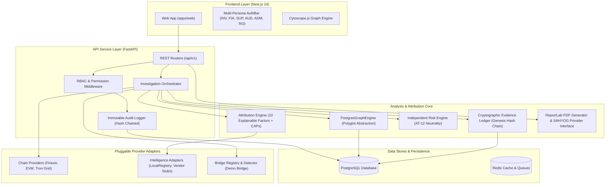

# VASP-Trace Architecture & Technical Reference

## 1. System Overview

`VASP-Trace` is a production-grade cryptocurrency investigative tracing and candidate VASP (Virtual Asset Service Provider) attribution platform designed for law enforcement agencies, FIUs, and financial analysts.

---

## 2. Technical Stack

| Layer | Technology |
|---|---|
| **Backend Framework** | Python 3.11, FastAPI, Pydantic v2 |
| **ORM / Database Access** | SQLAlchemy 2.0 (Async Engine via `asyncpg`, Sync Engine via `psycopg`) |
| **Relational Storage** | PostgreSQL 15 (Docker) / SQLite in-memory (Unit Tests) |
| **Async Tasks & Queues** | Celery 5.3 + Redis 7 |
| **PDF Generation** | ReportLab 4.x |
| **Frontend Framework** | Next.js 14 (React 18), Tailwind CSS, TypeScript |
| **Graph Visualization** | Cytoscape.js |

---

## 3. Core Architectural Principles & Invariants

1. **G2 Explainability Invariant:** Every attribution score is 100% explainable. The sum of all active feature contributions equals the raw score within $\pm 0.001$:
   $$\sum \text{contributions} == \text{raw\_score} \pm 0.001$$
2. **AT-12 Attribution / Risk Independence:** The Attribution Engine (`app.attribution`) has zero import or operational dependencies on the Risk Engine (`app.risk`). Modifying or toggling risk signals never alters entity attribution math.
3. **FR-RISK-04 VASP Neutrality:** Regulated VASP nodes are terminal graph destinations and carry zero risk score or illicit label. Risk scoring evaluates transit trails and source behavior only.
4. **FR-EVD-01 Evidence Gate:** Every attribution candidate must link to at least 1 verified cryptographic evidence record in the immutable ledger.
5. **FR-RPT-02 Epistemic Labeling:** Every fact row carries an explicit provenance class (`OBSERVED`, `THIRD-PARTY INTELLIGENCE`, `DERIVED`, `INFERENCE`). Unlabeled facts raise errors.
6. **Separation of Duties (FR-RPT-04, FR-SAH-04):** Report authors cannot approve their own reports; SAHYOG request drafters cannot submit statutory requests.

---

## 4. Extensibility Guide

### How to Add a New Blockchain (`ChainProvider`)
1. Implement the `ChainProvider` async protocol in `app/chain/my_chain_provider.py`.
2. Implement required operations: `validate_address`, `get_transactions`, `get_token_transfers`, `get_balance`.
3. Register the provider in `InvestigationOrchestrator`'s provider mapping.

### How to Add a New Intelligence Adapter (`IntelligenceAdapter`)
1. Implement `IntelligenceAdapter` in `app/registry/adapters/my_adapter.py`.
2. Implement `lookup_address(chain, address)` returning candidate `VaspAddress` records.
3. Register the adapter in `LocalRegistryAdapter` / `CompositeRegistryAdapter`.

### How to Add a New Cross-Chain Bridge
1. Add contract addresses and ABI signatures to `BridgeRegistryModel` or `data/demo/registry/vasps.json`.
2. Implement custom matching logic in `BridgeAdapter` if non-standard event signatures are used.
